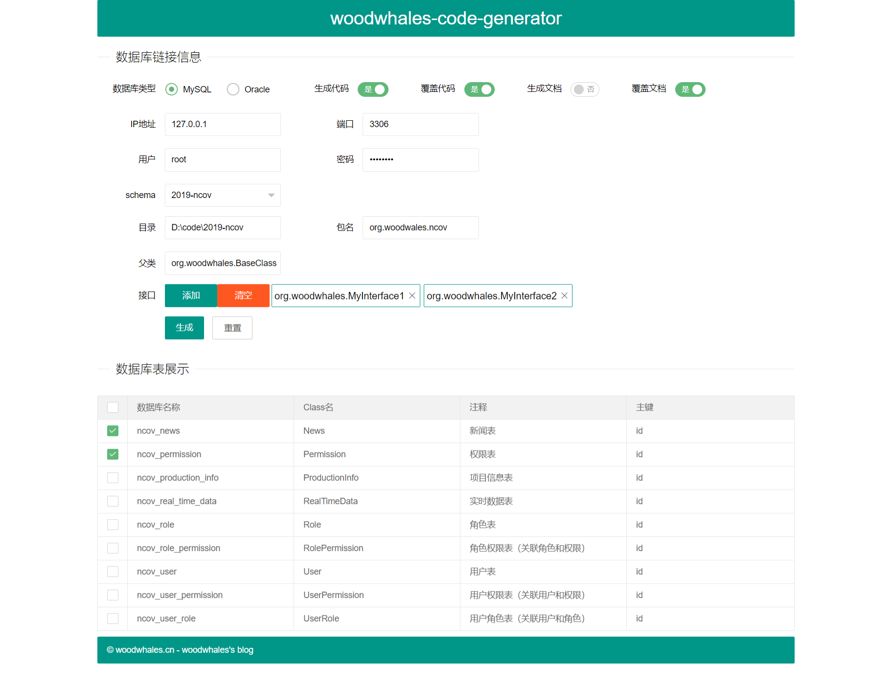
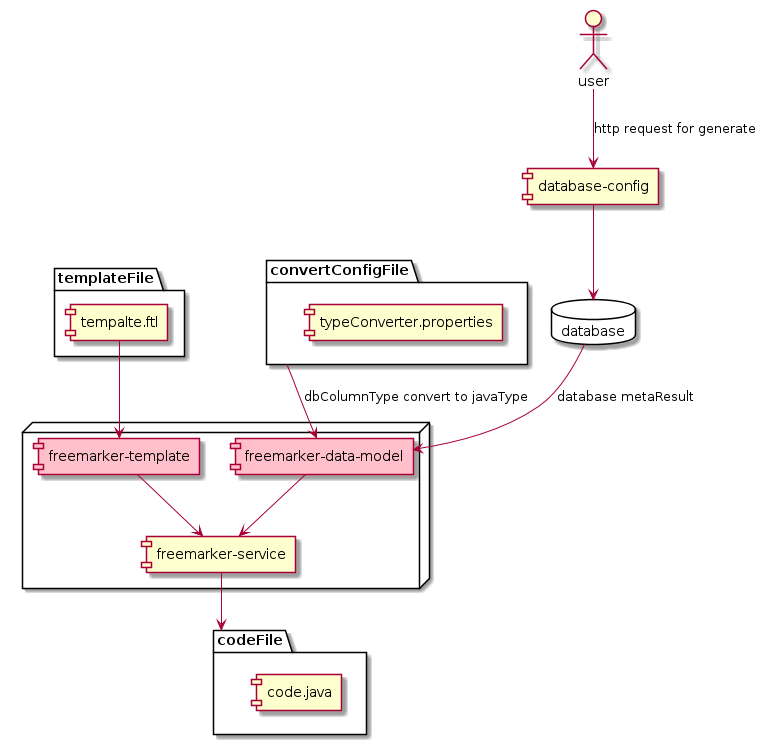

# woodwhales-code-generator
woodwhales-code-generator 代码生成工具

> 代码生成工具，数据库表结构设计文档生成器

技术支持：freemarker

### 运行环境要求

JDK版本：JDK 1.8+

构建工具：maven

启动主程序，浏览器访问：http://127.0.0.1:10326/



> 目录：输入项目根目录即可。

### 核心模块

#### 核心模块图



#### plantUML 代码

```shell
@startuml

[database-config]
[freemarker-data-model]
[freemarker-service]
[freemarker-template]


database "database" {

}

package "codeFile" {
    [code.java]
}

package "templateFile" {
    [tempalte.ftl]
}

database -left-> [database-config] 
templateFile -down-> [freemarker-template]
[database-config] -down-> [freemarker-data-model]
[freemarker-data-model] -down-> [freemarker-service]
[freemarker-template] -down-> [freemarker-service]
[freemarker-service] -down-> codeFile

@enduml
```


