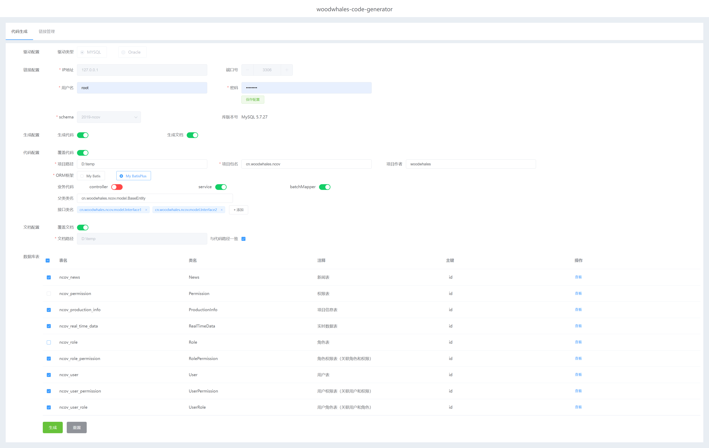

# woodwhales-code-generator

[](https://woodwhales.cn/) 

woodwhales-code-generator 代码生成工具

> 代码生成工具，数据库表结构设计文档生成器

技术支持：spring boot + mybatis-plus + freemarker

前端页面工程请移步至：[woodwhales-code-generator-web](https://github.com/woodwhales/woodwhales-code-generator-web)

### 功能特性

- 支持 MySQL、Oracle 数据库
- 通过数据库元信息，可视化生成：对应 Java 代码、数据库表结构设计文档
- 支持生成可扩展的自定义文档
- 动态配置，生成业务数据查询通用后台

### 运行环境要求

JDK版本：JDK 1.8+

构建工具：maven

启动主程序，浏览器访问：http://127.0.0.1:10326/

### 效果视图

#### 代码生成

- 首页



### windows 服务安装

步骤1：下载 [Windows Service Wrapper](https://github.com/winsw/winsw/releases/)，得到：[WinSW-x64.exe](https://github.com/winsw/winsw/releases/download/v3.0.0-alpha.10/WinSW-x64.exe) 文件

步骤2：使用 maven 命令打包本项目程序，得到：woodwhales-code-generator.jar

步骤3：将步骤1 和步骤2 的文件放在相同目录下，并将 WinSW-x64.exe 文件和 jar 文件重命名一致，如：woodwhales-code-generator

步骤4：在步骤3 的目录中创建 xml 文件，文件名为：woodwhales-code-generator.xml

```xml
<service>
    <id>woodwhales-code-generator</id>
    <name>woodwhales-code-generator</name>
    <description>woodwhales-code-generator 代码生成工具</description>
    <env name="C:\programs\run\code-generator" value="%BASE%"/>
    <executable>java</executable>
    <arguments>-jar -Dfile.encoding=utf-8 "%BASE%\woodwhales-code-generator.jar"</arguments>
      <!-- 开机启动 -->
     <startmode>Automatic</startmode>
    <log mode="roll-by-time">
		<pattern>yyyyMMdd</pattern>
    </log>
</service>
```

上述`env` 的 name 是步骤3 的服务部署目录绝对路径。

步骤5：使用管理员角色启动 cmd，cd 到服务服务部署目录，执行如下命令：

```cmd
woodwhales-code-generator.exe install
```

步骤6：启动 woodwhales-code-generator.jar 为 windows 服务：

```cmd
net start woodwhales-code-generator
```

> 停止命令：net stop woodwhales-code-generator
>
> 删除 windows 服务命令：sc delete woodwhales-code-generator

### 核心模块

#### 核心模块图


#### plantUML 代码

```shell
@startuml
[database-config]


node {
	[freemarker-data-model]  #pink
	[freemarker-template]  #pink
    [freemarker-service]
}

database "database" {
}

package "codeFile" {
    [code.java]
}

package "templateFile" {
    [tempalte.ftl]
}

package "convertConfigFile" {
    [typeConverter.properties]
}

Actor user

user -down-> [database-config] : http request for generate
[database-config] -right-> database
[tempalte.ftl] -right-> [freemarker-template]
database -down-> [freemarker-data-model] : database metaResult
convertConfigFile -down-> [freemarker-data-model] : dbColumnType convert to javaType
[freemarker-data-model] -down-> [freemarker-service]
[freemarker-template] -right-> [freemarker-service]
[freemarker-service] -down-> codeFile
@enduml
```
