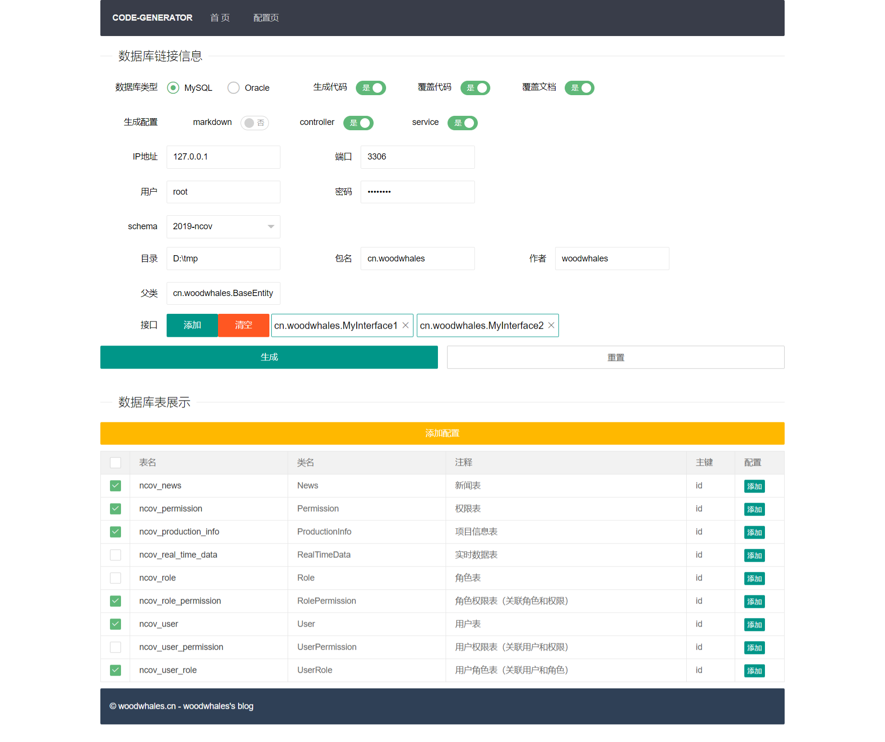
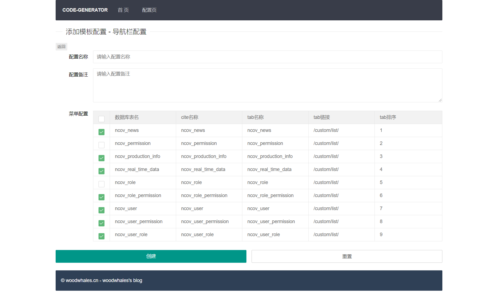
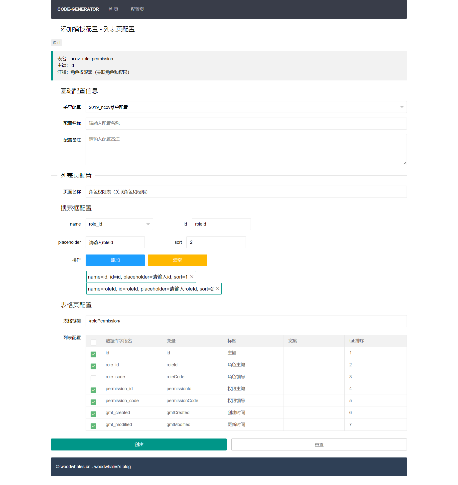
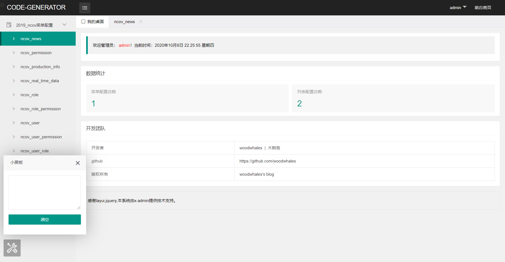
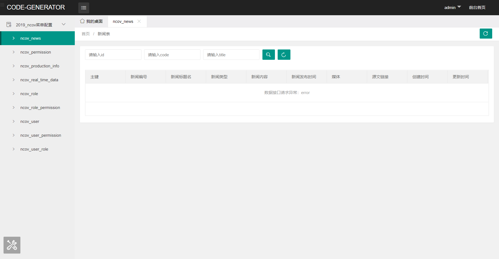

# woodwhales-code-generator

[](https://woodwhales.cn/) 

woodwhales-code-generator 代码生成工具

> 代码生成工具，数据库表结构设计文档生成器

技术支持：spring boot + mybatis-plus + freemarker + thymeleaf + layui + x-admin

### 功能特性

- 支持 MySQL、Oracle 数据库
- 通过数据库元信息，可视化生成：对应 Java 代码、数据库表结构设计文档
- 支持生成可扩展的自定义文档
- 动态配置，生成业务数据查询通用后台

### 运行环境要求

JDK版本：JDK 1.8+

构建工具：maven

启动主程序，浏览器访问：http://127.0.0.1:10326/

### 效果视图

#### 代码生成

- 首页



- 配置导航栏



- 配置列表页



#### 业务数据

- 首页



- 业务



> 目录：输入项目根目录即可。

### 核心模块

#### 核心模块图


#### plantUML 代码

```shell
@startuml
[database-config]


node {
	[freemarker-data-model]  #pink
	[freemarker-template]  #pink
    [freemarker-service]
}

database "database" {
}

package "codeFile" {
    [code.java]
}

package "templateFile" {
    [tempalte.ftl]
}

package "convertConfigFile" {
    [typeConverter.properties]
}

Actor user

user -down-> [database-config] : http request for generate
[database-config] -right-> database
[tempalte.ftl] -right-> [freemarker-template]
database -down-> [freemarker-data-model] : database metaResult
convertConfigFile -down-> [freemarker-data-model] : dbColumnType convert to javaType
[freemarker-data-model] -down-> [freemarker-service]
[freemarker-template] -right-> [freemarker-service]
[freemarker-service] -down-> codeFile
@enduml
```
